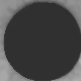

# IRIS-RECOGNITION-USING-MACHINE-LEARNING-TECHNIQUE
# 📌 Project Overview

This project is developed to recognize persons using IRIS images with the help of Machine Learning and CNN (Convolutional Neural Network).

The system uses the CASIA IRIS dataset containing iris images of 108 different people.  
HoughCircles algorithm is used to extract iris features from eye images, and then the CNN model predicts the person ID accurately.

# 🚀 Features

- Iris recognition using CNN
- Iris feature extraction using HoughCircles
- Person identification from iris images
- Accuracy and loss visualization
- GUI-based implementation
- Supports real-time iris image testing

# 🧠 Technologies Used

- Python
- CNN (Convolutional Neural Network)
- OpenCV
- NumPy
- TensorFlow / Keras
- Machine Learning


# 📂 Dataset

The project uses the CASIA IRIS dataset.

-i have the only given very less data since it cannot upload more than 100  files
- Contains iris images of 108 persons
- Dataset stored inside the `3,4,5,6,7,8` folder
- Used for training and testing the CNN model

# ⚙️ Working Process

1. Upload the CASIA IRIS dataset
2. Extract iris features using HoughCircles
3. Train CNN model using extracted features
4. Generate prediction model
5. Upload test iris image
6. Predict the person ID

# 📈 Model Accuracy

- Total Images Used: 683(based on data set)
- Total Persons: 108
- Prediction Accuracy: 100%

# 📊 Accuracy & Loss Graph

- Red Line → Loss Value
- Green Line → Accuracy Value

As epochs increase:
- Loss decreases to 0
- Accuracy increases to 100%


# 📸 Screenshots

Add project screenshots here.

Example:



# 🎯 Conclusion

This project demonstrates the use of Deep Learning and CNN techniques for accurate iris recognition and biometric identification.

---

# 🔟 How to Run the Project

Give execution steps.

```md id="0w8zyf"
## ▶️ How to Run

### Step 1
Run the `run.bat` file

### Step 2
Upload the CASIA1 dataset folder

### Step 3
Click on `Generate & Load CNN Model`

### Step 4
View Accuracy & Loss Graph

### Step 5
Upload a test iris image to recognize person ID
